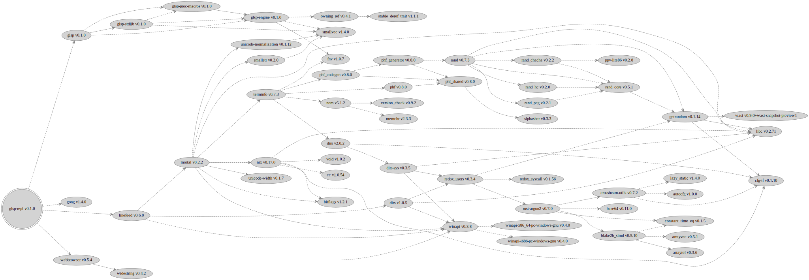

# GameLisp command line REPL
A command line [Read-Eval-Print-Loop](https://en.wikipedia.org/wiki/Read%E2%80%93eval%E2%80%93print_loop)
for [GameLisp](https://gamelisp.rs).
Runs on Linux, MacOS X, and Windows both in PowerShell and CMD.EXE
but [Mintty](https://mintty.github.io/) ([Cygwin](https://www.cygwin.com/), [MSYS2](https://www.msys2.org/))
is [not supported](https://github.com/murarth/linefeed/issues/68) and works
only in [dumb terminal](https://books.google.com/books?id=jT2fQqJplN8C&lpg=PT3&pg=PT3) mode.

It can be used for running GameLisp programs from shell scripts by
passing their file names as arguments.
With the `-q` option, the program quits before starting the REPL.
Without `-q`, the REPL starts right after loading all the files
and has access to the globals defined in them. There is no default init file.

Usage: `glsp <options> [file.glsp file2.glsp ...]`

- `-h`, `-help`
  Show this message.
- `-v`, `--version`
  Show the version number and exit.
- `-q`
  Quit before starting the REPL, to use as a command in shell scripts.
- `--sandboxed`
  Disables filesystem access: load, include, and require.
  https://gamelisp.rs/reference/the-glsp-crate.html#sandboxing
- The command input history is stored in "`./glsp-repl_history`".

`help name` is short for `(www (help "name"))` and shows the documentation
for `name` in a web browser.
E.g.: `rust`, `lisp`, `std`, `special-forms`, `abbreviations`, `if`, `'`, `@`, `#n`, `#t`, `#f`.
Without argument, shows the reference manual.

`(www "url")` loads `url` in a web browser, unless using `--sandboxed`.

Shows how to:

- create a GameLisp [runtime instance with options](https://docs.rs/glsp/*/glsp/struct.RuntimeBuilder.html)
  ([`sandboxed`](https://gamelisp.rs/reference/the-glsp-crate.html#sandboxing),
  ...).
- [load](https://docs.rs/glsp/*/glsp/fn.load.html) source files into it.
- [parse](https://docs.rs/glsp/*/glsp/fn.parse_all.html) and
  [evaluate](https://docs.rs/glsp/*/glsp/fn.eval_multi.html)
  expressions in that runtime.
- call Rust functions from GameLisp: see the `www(url: Option<&str>)` function in `src/main.rs`.

## Dependencies

- Command line options parsing:
  [gong](https://crates.io/crates/gong)
- Command line interaction, history:
  [linefeed](https://crates.io/crates/linefeed)
- Open URLs in the system’s web browser:
  [webbrowser](https://crates.io/crates/webbrowser)

