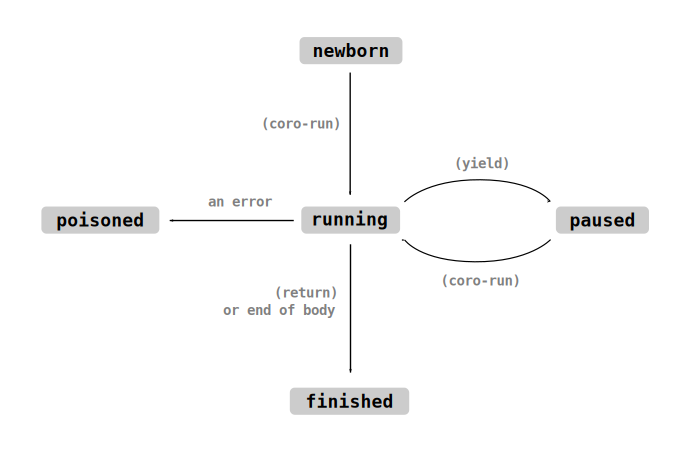

# Coroutines

A coroutine is a function which can be paused, and later on resumed from where it left off.

Coroutines are defined using the [`yield`](../std/yield) special form. When `yield` is encountered 
within a function, that function pauses its execution, and control flow returns to the caller. 
Later, [`coro-run`](../std/coro-run) can be used to resume the coroutine, which causes execution 
to restart from the `yield` form.

	(defn example+ ()
	  (pr "first ")
	  (yield)
	  (prn "third"))

	; invoking a function which contains a (yield) does not start its execution.
	; instead, it returns a coroutine which is paused at the start of the
	; function's body.
	(let coroutine (example+))

	(coro-run coroutine) ; executes up until the yield
	(pr "second ")
	(coro-run coroutine) ; executes from the yield to the end of the function

	; the above code prints: first second third

Coroutines can pass values back and forth to their caller when they are paused and resumed.
`(yield x)` causes the value `x` to be returned from the `(coro-run ...)` call. 
`(coro-run coroutine y)` causes the value `y` to be returned from the `(yield)` call. In both 
cases, when no value is specified it defaults to `#n`.
	
	; this coroutine returns values to its caller. note that coroutines can
	; receive arguments, just like a normal function call
	(defn increment-forever+ (n)
	  (loop
	    (yield n)
	    (inc! n)))

	(let co (increment-forever+ 100))

	(prn (coro-run co)) ; prints 100
	(prn (coro-run co)) ; prints 101
	(prn (coro-run co)) ; prints 102

	; this coroutine receives values from its caller
	(defn overly-elaborate-prn+ ()
	  (loop
	    (prn (yield))))

	(let co (overly-elaborate-prn+))
	(coro-run co) ; run until the first (yield)...

	(coro-run co 'alpha) ; the coroutine prints alpha
	(coro-run co 'beta) ; the coroutine prints beta
	(coro-run co 'gamma) ; the coroutine prints gamma

[`fn-yields?`](../std/fn-yields-p) will tell you whether or not a function will create a
coroutine when called.

By convention, functions which `yield` have `+` appended to the end of their name. This helps
to prevent mistakes when refactoring a non-yielding function into a yielding function, or 
vice-versa.

## Life-Cycle of a Coroutine

The [`coro-state` function](../std/coro-state) returns a symbol describing the current state of a 
coroutine: `newborn`, `running`, `paused`, `finished` or `poisoned`.

When you call a function which has at least one `yield` form somewhere in its body, it will return
a `newborn` coroutine. You can execute it with `coro-run`; a currently-executing coroutine is
in the `running` state. When it encounters a `yield` form, it will become `paused`, meaning it 
can be resumed again with `coro-run`. When a `running` coroutine returns, it will transition to 
the `finished` state, which is the end of its life-cycle.

If an [error](errors.md) bubbles through a coroutine while it's executing, we assume that it's
been left in a disorderly state. Its state is set to `poisoned`, and any attempt to resume it
will trigger an error. This is analogous to how Rust's [`Mutex` type] works.

[`Mutex` type]: https://doc.rust-lang.org/std/sync/struct.Mutex.html

## Coroutines and Iteration

Coroutines are `iterable`. A coroutine iterator will repeatedly call `(coro-run the-coro)` and 
produce each value which the coroutine yields.

This can be used to implement custom iterators:
	
	; a coroutine-based implementation of the `lines` function. copies 
	; a string and then splits it into individual lines, yielding one 
	; line at a time. once there are no lines left, it returns.
	(defn lines+ (source-str)
	  (let st (clone source-str))
	  (while (> (len st) 0)
	    (let pos (position st \newline))
	    (cond
	      ((nil? pos)
	        (yield st)
	        (break))
	      (else
	      	(let line (remove! st : pos))
	      	(pop-start! st)
	        (yield line)))))

	(prn (arr ..(lines+ "aaa\nbbb\nccc"))) ; prints ("aaa" "bbb" "ccc")

## Stackful and Stackless Coroutines

In languages like Lua and Ruby, coroutines are "stackful". Each coroutine allocates its own 
call-stack, and it can yield from arbitrarily deep within that call-stack.

On the other hand, GameLisp's coroutines follow the model set by Rust, Python, C# and C++. Our
coroutines are "stackless": they only store enough data to pause a single call-frame, so it's
not possible for a coroutine to call a non-coroutine function and `yield` from inside it. You 
can only `yield` from the body of the coroutine function itself.

The primary reason for this is that it's much more efficient. Each and every Ruby coroutine 
(known as a [`Fiber`]) allocates a four-kilobyte, fixed-size callstack. In contrast, a typical
GameLisp coroutine will only allocate 100 to 300 bytes of data - about one-twentieth of the memory 
burden!

[`Fiber`]: https://ruby-doc.org/core-2.7.1/Fiber.html

The other reason to prefer stackless coroutines is that they can be nested almost as
straightforwardly as stackful coroutines. The [`yield-from` macro](../std/yield-from) will loop 
through an `iterable`, repeatedly yielding each of its results until it's finished. When the 
`iterable` is a coroutine, this is roughly equivalent to calling a function and yielding from 
inside it.
	
	; a coroutine which keeps yielding until some event is triggered,
	; and then returns
	(defn wait-until-trigger+ (trigger-name)
	  (until (trigger-set? trigger-name)
	    (yield)))

	; a coroutine which controls the behaviour of an entity. the coroutine is
	; resumed once per frame. it will do nothing until the 'can-move event 
	; has been triggered, and then it will horizontally slide towards the 
	; target x coordinate, bit by bit, until it has been reached.
	(defn move-to+ (self x-target)
	  (yield-from (wait-until-trigger+ 'can-move))

	  (until (= [self 'x] x-target)
	    (seek! [self 'x] x-target 1.5)
	    (yield)))

## Why Coroutines?

Coroutines can be thought of as a form of cooperative multitasking. They behave like 
operating-system threads, but rather than being interrupted at unpredictable intervals by the 
scheduler, they're allowed to execute for as long as they please. The coroutine itself decides 
when to manually end its time-slice and yield control back to the "scheduler" (in this case,
the function which invoked `coro-run`).

This type of control flow is a natural fit for game programming. Game worlds tend to be filled
with entities which perform complicated behaviours, splitting their actions into tiny incremental
"steps". When the entity isn't doing anything too elaborate, it's easy to model their behaviour
as a simple function which is called once per frame - but when you want to do a few different
things in sequence, "action A followed by action B followed by action C", then coroutines are
usually a much better choice.

Consider a cutscene script controller. We want this cutscene to show a dialogue bubble until the
player dismisses it, then have the main character walk to the right until they reach a
waypoint, then pause dramatically for three seconds, then show another dialogue bubble. 
Cramming all of this state into a single event-handler function is a real challenge:
	
	(defn step-handler (self)
	  (match [self 'current-state]
	    ('start
	      (= [self 'bubble] (speak self "You don't understand! I just have..."))
	      (= [self 'current-state] 'bubble-0))

	    ('bubble-0
	      (when (bubble-finished? [self 'bubble])
	        (= [self 'current-state] 'walking-to-waypoint)))

	    ('walking-to-waypoint
	      (step-towards-point self (waypoint 'dramatic-pause))
	      (when (at-waypoint? self (waypoint 'dramatic-pause))
	        (start-sound 'howling-wind)
	        (= [self 'pause-timer] 3.0)
	        (= [self 'current-state] 'pausing)))

	    ('pausing
	      (dec! [self 'pause-timer] :dt)
	      (when (<= [self 'pause-timer] 0.0)
	        (= [self 'bubble] (speak self "...too many Incredibly Deep Feelings."))
	        (= [self 'current-state] 'bubble-1)))

	    ('bubble-1
	      (when (bubble-finished? [self 'bubble])
	        ; leave the viewer to process the scene's breathtaking emotional pathos
	        (= [self 'current-state] 'finished)))))

The equivalent coroutine is a beauty:
	
	(defn run-cutscene+ (self)
	  (yield-from (speak+ self "You don't understand! I just have..."))
	  (yield-from (walk-to-point+ self (waypoint 'dramatic-pause)))
	  (start-sound 'howling-wind)
	  (yield-from (wait-secs+ 3.0))
	  (yield-from (speak+ self "...too many Incredibly Deep Feelings.")))

All of that state which we had to manually store elsewhere is now implicit in the coroutine.
The child functions would be simpler, too: the coroutine `walk-to-point+` is likely to be much
easier to implement, compared to the function `step-towards-point`. Our coroutine even has 
slightly better performance! Previously we were calling `(waypoint)` every frame because it would 
have been too much effort to cache it, but the coroutine makes it obvious that rechecking the 
waypoint every frame is actually the more-expensive option.

Cutscene scripting is usually such a nightmare that many smaller game projects either give up
hope of doing anything interesting with it, or come up with some hacky, limited, data-driven 
cutscene control library. But with the incredible power of coroutines, it's all just code, and you 
can make your cutscenes as complicated and emotional as you like! Try not to make your players 
cry too much.

Coroutines are particularly powerful when combined with explicit state machines. We'll explore 
the possibilities in more depth when we discuss [object-oriented 
programming](object-oriented-programming.md).
