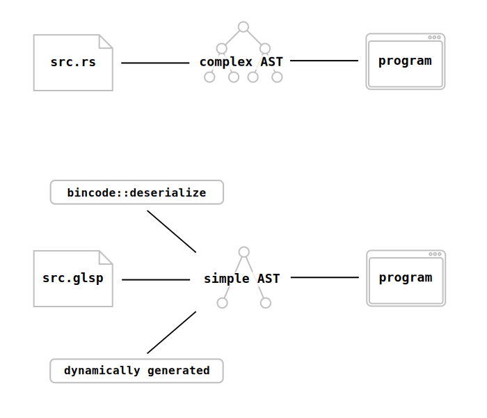

# Syntax and Types

Here is a toy GameLisp program which calculates the first thirty Fibonacci numbers:

	(let fibs (arr 0 1))

	(while (< (len fibs) 31)
	  (push! fibs (+ [fibs -1] [fibs -2])))

	(prn [fibs -1]) ; prints 832040

In this chapter, we will describe GameLisp's syntax in full; explain why it's so different from 
the syntax of languages like Rust; and start to think about the unique advantages which come from 
those differences.


## Homoiconicity

All programming languages have something called an [abstract syntax tree] (AST): a data
representation of a program's source code. The AST is usually hidden inside the compiler, where 
the programmer can't interact with it directly.

For example, this fragment of Rust source code...
	
```rust
foo.bar(1)
```

...could be represented by this (imaginary) AST data structure:
	
```rust
Expression::MethodCall {
	callee: Identifier("foo"),
	method_name: Identifier("bar"),
	arguments: vec![
		Expression::Literal(Literal::Int(1))
	]
}
```

You've probably also encountered text-based data interchange formats, like [JSON] or [TOML]. They 
provide a way for us to store common data structures, like arrays, hash tables, booleans and
strings, in a human-readable file format which is easy to edit.

For example, this fragment of JSON describes an array which contains each of the integers
from 0 to 4 inclusive:

```json
[0, 1, 2, 3, 4]
```

GameLisp, like all Lisp languages, is [homoiconic]. This means that its AST is made out of simple, 
primitive data types like arrays and booleans - the same data types which you might encounter in
a JSON file. Let's look more closely at the first line of our Fibonacci program:

	(let fibs (arr 0 1))

This is just the text representation of an array with these three elements:
	
- The symbol `let`
- The symbol `fibs`
- A nested array, with these three elements:
	- The symbol `arr`
	- The integer `0`
	- The integer `1`

A comparable JSON fragment would be:

```json
["let", "fibs", ["arr", 0, 1]]
```

In other words, in GameLisp, **code is data and data is code**. A GameLisp program is *not*
defined by a block of text - instead, it's defined by a tree of simple data-types. That tree
could have been read from a text file, but it could just as well have been generated from nothing 
by a GameLisp program, or deserialized from a binary file using [Serde](https://serde.rs), or any 
number of other possibilities.



[abstract syntax tree]: https://en.wikipedia.org/wiki/Abstract_syntax_tree
[JSON]: https://en.wikipedia.org/wiki/JSON
[TOML]: https://en.wikipedia.org/wiki/TOML
[homoiconic]: https://en.wikipedia.org/wiki/Homoiconicity


## Expansion

There's no sense in denying it: building programs out of array literals causes them to have a 
relatively ugly syntax. Why is GameLisp designed this way?

The big advantage is that, when code is data, it becomes much easier to write code which creates 
or modifies other code on your behalf. There's no need to mess around with an AST or manipulate 
the raw text of your program - it's all just arrays!

For example, here's a GameLisp program which reads in a GameLisp source file, performs
`gettext`&#8209;style localization on it (replacing English string literals with French 
string literals based on a one-to-one mapping listed in a file), and then runs the program:
	
	(let replacements (parse-1 (read-file "en-to-fr.glsp")))
	(let source (parse-all (read-file "source.glsp")))

	(let-fn recursively-translate (val)
	  (match val
	    (coll : (or arr? tab?)
	      (map-syntax recursively-translate coll))
	    (st : str?
	      (or [replacements (? st)] st))
	    (val
	      val)))
	
	(eval-multi (recursively-translate source))

To make this kind of code-generation more convenient, all GameLisp code is automatically put through 
an "expansion pass" just before being run. The expansion pass inspects each array in the program; 
checks whether that array's first element is the name of a macro (a function which transforms 
GameLisp source code into different GameLisp source code); and if so, uses that macro to 
transform the array into something else. 

Unlike Rust macros, GameLisp macros are indistinguishable from the language's built-in syntax.
This gives you the ability to profoundly customise the language - we'll explore some of the
possibilities in the [Macros](macros.md) chapter. 


## Representable Types

GameLisp is a dynamically-typed language. Memory locations like global variables, table fields
and function arguments always store a single generic "value", which can belong to any of 
sixteen different primitive types. The full set of types is [summarized below](#type-summary).

Of these sixteen types, nine of them can be losslessly converted into text and
then read back in by the parser. We say that they are "representable", because they have an exact
text representation. Valid GameLisp source code is entirely made out of these representable types.


### `nil`

`nil` is the type of a value which is absent, uninitialized or undefined. In Rust terms, it
takes on the roles of both `None` and `()`.

It only has one value, which is represented as `#n`.


### `bool`

`bool` is the type of a boolean value: either true (represented as `#t`) or false (represented
as `#f`).

When testing whether or not a value is true (for example, when deciding how an `if` expression
should branch), we consider `#f` and `#n` to be "falsy" values, and all other values to be 
"truthy".


### `int`, `flo`

The `int` type is a 32-bit signed integer number: an `i32`.

The `flo` type is a 32-bit floating-point number: an `f32`.

The text representation for numbers is almost identical to [their representation in Rust]. You can
embed underscores in numbers, and integers can be prefixed with `0b`, `0o` or `0x` to change their
base.

There are only a few small changes compared to Rust's syntax:
- Type suffixes, like `_i8` or `_f32`, are forbidden.
- Infinities are represented as `+inf.0` and `-inf.0`.
- "Not a number" is represented as `nan.0`.

We'll discuss these types in more detail in the [Numbers](numbers.md) chapter.

[their representation in Rust]: https://doc.rust-lang.org/reference/tokens.html#number-literals


### `sym`

The `sym` type is a symbol, also known as an [interned string].

[interned string]: https://en.wikipedia.org/wiki/String_interning

GameLisp uses symbols to represent identifiers and keywords in an efficient way. In the declaration 
`(let var-name 0)`, both `let` and `var-name` are symbols. Representing them as symbols rather 
than strings makes several basic operations much faster: comparing one identifier to another,
looking up a global variable, parsing a keyword from a file, and so on.

A symbol's name is a sequence of one or more of the following characters: `a` to `z`, `A` to `Z`, 
`0` to `9`, `!`, `$`, `%`, `&`, `*`, `+`, `-`, `.`, `/`, `:`, `<`, `=`, `>`, `?`, `^`, `~` or `_`.
A symbol can optionally be suffixed with a single `#`.

This opens up a much richer selection of identifiers, compared to Rust. Any of the following 
symbols would be valid names for a variable:
	
	push!
	int?
	name=
	foo:bar
	-
	//
	1+
	&$+%~#

When the parser encounters a sequence of characters which could represent a symbol, or could
represent a number or [abbreviation](#abbreviations), then the number or abbreviation will take
priority. This means that not all symbols are representable. The symbol `-10` can exist, but if 
you write it to a file, it will be read back in as a number instead.


### `char`

The `char` type is a character. Its storage is identical to a [Rust `char`].

Characters are represented by a backslash followed by the character itself - for example, 
`\a`, `\(`, or `\🦀`.

Certain whitespace characters are represented by a backslash followed by their name: `\space`,
`\tab`, `\newline`, `\return`, and `\nul`.

You can represent an arbitrary unicode character as either... 
- `\xNN`, where `NN` is a hexadecimal value from `00` to `7f` inclusive.
- `\u{NN}`, where the curly braces may enclose anywhere from one to six hexadecimal digits.

[Rust `char`]: https://doc.rust-lang.org/reference/types/textual.html


### `str`

The `str` type is a text string.

The representation of strings is identical to a [Rust string literal], including all of the same 
escape sequences. Raw strings, like `r##"text"##`, are supported.

Strings, characters and symbols are all discussed together in the [Strings and 
Text](strings-and-text.md) chapter.

[Rust string literal]: https://doc.rust-lang.org/reference/tokens.html#string-literals


### `arr`

The `arr` type is an array of arbitrary values. More specifically, it's a double-ended 
queue, similar to [`VecDeque`] in Rust.

An array is represented by the open-parenthesis `(`, followed by the representation of zero
or more values, followed by the close-parenthesis `)`.

For example, an array containing squares of the first five positive integers would be represented 
as `(1 4 9 16 25)`. An empty array would be represented as `()`.

The [Arrays](arrays.md) chapter has more details.

[`VecDeque`]: https://doc.rust-lang.org/std/collections/struct.VecDeque.html


### `tab`

The `tab` type is a table (specifically, a [`HashMap`]) which maps values to values.

A table is represented by `#(`, followed by zero or more key-value pairs, each with the same 
representation as an array of length two, followed by the close-parenthesis `)`.

For example, `#((a b) (100 200))` represents a table which contains the value `b` bound to the key 
`a`, and the value `200` bound to the key `100`.

See the [Tables](tables.md) chapter for more.

[`HashMap`]: https://doc.rust-lang.org/std/collections/struct.HashMap.html


## Whitespace

The parser ignores whitespace, except for marking the boundary between one token and the next.
All comments are parsed as whitespace.

A line comment is introduced with a single `;` and continues until the next newline.

A block comment begins with `#|` and ends with `|#`. Block comments can be nested. An unterminated
block comment is a syntax error.

Prefixing a value with `#;` will turn that entire value into a comment. This can be a convenient 
way to comment out code:
	
	(when (< a 100)
	  (new-handler (+ a 1))
	  #;(when handler-enabled?
	    (old-handler)))

The comma `,` is a whitespace character - this can be helpful for visually breaking up long
sequences into smaller groups.
	
	(let a b, c d, e f) ; easier to read
	(let a b c d e f)   ; harder to read


## Abbreviations

Some patterns appear so frequently in GameLisp programs that they've been given dedicated
syntax. All of these abbreviations represent an array. For example, if you try to print the 
two-element array `(splay val)`, it will be printed as `..val`.

The abbreviations are:

|Abbreviation|Represents|
|------------|----------|
|`'val`|[`(quote val)`](../std/quote)|
|`` `val``|[`(backquote val)`](../std/backquote)|
|`~val`|[`(unquote val)`](../std/unquote)|
|`[x y]`|[`(access x y)`](../std/access)|
|`..val`|[`(splay val)`](../std/splay)|
|`@val`|[`(atsign val)`](../std/atsign)|
|`.val`|[`(meth-name val)`](../std/meth-name)|

In addition, we use curly braces for string interpolation. When a string contains curly braces, 
it actually represents an array rather than a string. These two lines are exactly equivalent:

	"text {a}{b} {c d}"
	(template-str "text " a "" b " " c d)

Curly-brace characters in a string can be escaped by doubling them, as in `{{` or `}}`. Raw
strings cannot be interpolated.


## Type Summary

The seven non-representable primitive types are each discussed in future chapters. For now, a 
quick summary of all of `val`'s possible types:
	
| Name | Meaning | Truthy? | Reference? |
|------|---------|:-------:|:------:|
|`nil`|Absent or undefined value|No|No|
|`bool`|Boolean|Varies|No|
|`int`|32-bit signed integer|Yes|No|
|`flo`|32-bit floating-point number|Yes|No|
|`char`|Character|Yes|No|
|`sym`|Symbol|Yes|Yes|
|`arr`|Array|Yes|Yes|
|`str`|String|Yes|Yes|
|`tab`|Table|Yes|Yes|
|`iter`|Iterator|Yes|Yes|
|`obj`|Object|Yes|Yes|
|`class`|Class|Yes|Yes|
|`fn`|Function|Yes|Yes|
|`coro`|Coroutine|Yes|Yes|
|`rfn`|Rust function|Yes|Yes|
|`rdata`|Rust data|Yes|Yes|

### Abstract Types

Abstract types group together multiple primitive types which share a common API.

| Abstract Type | API | Concrete Types |
|------|---------|-------|
|`num`|Number|`int`, `flo`|
|`deque`|Double-ended queue|`arr`, `str`|
|`callable`|Function-call receiver|`fn`, `rfn`, `class`|
|`expander`|Macro expander|`fn`, `rfn`|
|`iterable`|Iterable|`arr`, `str`, `tab`, `coro`, `iter`|
